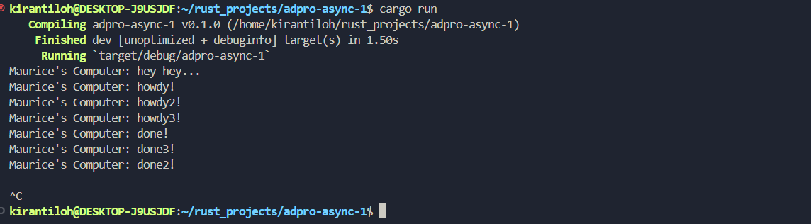

Hasil dari kode ini disebabkan pada waktu kapan fungsi tersebut dijalankan. Pada saat fungsi `main()` dijalankan, semua fungsi sinkronus akan dijalankan terlebih dahulu (Print "hey hey") lalu fungsi asinkronus akan dijalankan. 

Fungsi `drop()` memberi tahu kepada executor bahwa tidak ada lagi task yang akan dijalankan. Sehingga executor tidak akan menunggu semua task yang ada selesai dijalankan. Karena fungsi `drop()` tidak dijalankan pada contoh ini, maka executor akan menganggap masih task yang belum selesai dijalankan.