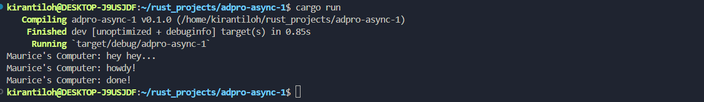

Hasil dari kode ini disebabkan pada waktu kapan fungsi tersebut dijalankan. Pada saat fungsi `main()` dijalankan, semua fungsi sinkronus akan dijalankan terlebih dahulu (Print "hey hey") lalu fungsi asinkronus akan dijalankan. 